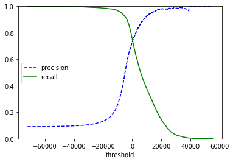
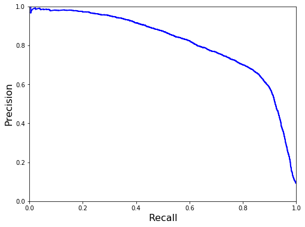
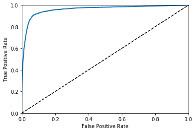

# Classification

Here are some notes that I jot down from [Hands-on Machine Learning with Scikit-Learn and TensorFlow](http://shop.oreilly.com/product/0636920052289.do). 

The jupyter notebook that I ran through this part can be found here: [html](classification.html) and [Jupyter Notebook](classification.ipynb).

## Table of Content

- [Fetch the MNIST Dataset](#1)
- [Traning a Binary Classifier](#2)
- [Performance Mesures](#3)
  - [Measuring Accuracy Using Cross-Validation](#3-1)
  - [Confusion Matrix](#3-2)
  - [Curves](#3-3)
- [Classification Types](#4)

<a name='1'></a>

## Fetch the MNIST Dataset

The dataset that we are using here is MNIST, which is a set of 70,000 small images of digits handwritten by high school students and employees of the US Census Bureau. To fetch the data, we can use the helper function provided by Scikit-Learn:

```python
# Fetch the MNIST dataset
from sklearn.datasets import fetch_openml
import numpy as np

mnist = fetch_openml('mnist_784', version=1)
X, y = mnist['data'], mnist['target']
y = y.astype(np.uint8)
X_train, X_test, y_train, y_test = X[:60000], X[60000:], y[:60000], y[60000:]
```

<a name='2'></a>

## Training a Binary Classifier

Here we use Stochastic Gradient Descent (SGD) classifier, which has the advantage of being capable of handling very large datasets efficiently. This is in part because SGD deals with training instances independently, one at a time (which also makes SGD well suited for online learning ).

```python
# Split into 5 and not 5 classes
y_train_5 = (y_train == 5)
y_test_5 = (y_test == 5)

# Fit and predict
sgd_clf = SGDClassifier(random_state=42, max_iter=1000, tol=1e-3)
sgd_clf.fit(X_train, y_train_5)
sgd_clf.predict([some_digit])
```

<a name='3'></a>

## Performance Measures

<a name='3-1'></a>

#### Measuring Accuracy Using Cross-Validation

```python
from sklearn.model_selection import cross_val_score
cross_val_score(sgd_clf, X_train, y_train_5, cv=3, scoring='accuracy')
```

<a name='3-2'></a>

####  Confusion Matrix

To better measure the performance of a classifier, we can use confusion matrix, where each row represents an actual class and each column represents a predicted class, shown as below:

|           |          | Prediction | Prediction |
| :-------: | :------: | :--------: | :--------: |
|           |          |  Positive  |  Negative  |
| **Truth** | Positive |     TP     |     FN     |
| **Truth** | Negative |     FP     |     TN     |

**Accuracy**: $Accuracy=\cfrac{TP+TN}{TP+FN+FP+TN}$

**Precision**: $Precision=\cfrac{TP}{TP+FP}$

We look at the <u>first  column</u> of the confusion matrix for precision.

**Recall** (True positive rate): $Recall=\cfrac{TP}{TP+FN}$

We look at the <u>first row</u> of the confusion matrix for recall.

**Specificity** (True negative rate): $Specificity=\cfrac{TN}{FP+TN}$

We look at the second row of the confusion matrix for specificity.

**FPR**: $FPR=1-Specificity=\cfrac{FP}{FP+TN}$. This is helpful to be used in the ROC curve.

**F1 Score**: It is the harmonic mean of the precision and recall. The classifier will only get a high F1 score if both precision and recall are high.

To implement the confusion matrix in Scikit-Learn, we need to predict the values using `cross_val_predict` and then call the `confusion_matrix` function. Then a confusion matrix will be returned in the structure as the table above.

```python
from sklearn.model_selection import cross_val_predict
from sklearn.metrics import confusion_matrix

y_train_pred = cross_val_predict(sgd_clf, X_train, y_train_5, cv=3)
confusion_matrix(y_train_5, y_train_pred)
```

To implement the precision, recall and F1 score:

```python
from sklearn.metrics import precision_score, recall_score, f1_score

precision_score(y_train_5, y_train_pred)
recall_score(y_train_5, y_train_pred)
f1_score(y_train_5, y_train_pred)
```

<a name='3-3'></a>

#### 3 Curves

```python
from sklearn.metrics import precision_recall_curve

# Get the precision, recall and threshold using the function in sklearn
precisions, recalls, thresholds = precision_recall_curve(y_train_5, y_scores)
```

##### Precision and Recall vs Threshold

```python
def plot_precision_recal_vs_threshold(precisions, recalls, 
                                      thresholds):
    plt.plot(thresholds, precisions[:-1], 'b--', label='precision')
    plt.plot(thresholds, recalls[:-1], 'g-', label='recall')
    plt.xlabel('threshold')
    plt.legend(loc='center left')
    plt.ylim([0, 1])
    
plot_precision_recal_vs_threshold(precisions, recalls, thresholds)
```



##### Precision vs Recall

```python
def plot_precision_vs_recall(precisions, recalls):
    plt.plot(recalls, precisions, "b-", linewidth=2)
    plt.xlabel("Recall", fontsize=16)
    plt.ylabel("Precision", fontsize=16)
    plt.axis([0, 1, 0, 1])

plt.figure(figsize=(8, 6))
plot_precision_vs_recall(precisions, recalls)
plt.show()
```




##### ROC Curve

The receiver operating characteristic (ROC) curve is another common tool used with binary classifiers. It is very similar to the precision/recall curve, but instead of plotting precision versus recall, the ROC curve plots the true positive rate (another name for recall) against the false positive rate . The FPR is the ratio of negative instances that are incorrectly classified as positive. It is equal to one minus the true negative rate , which is the ratio of negative instances that are correctly classified as negative. The TNR is also called specificity . Hence the ROC curve plots sensitivity (recall) versus 1 – specificity. 

```python
from sklearn.metrics import roc_curve

fpr, tpr, threshold = roc_curve(y_train_5, y_scores)

def plot_roc_curve(fpr, tpr, label=None):
    plt.plot(fpr, tpr, linewidth=2, label=label)
    plt.plot([0, 1], [0, 1], 'k--')
    plt.axis([0, 1, 0, 1])
    plt.xlabel('False Positive Rate')
    plt.ylabel('True Positive Rate')
    
plot_roc_curve(fpr, tpr)
plt.show()
```




One way to compare classifiers is to measure the area under the curve (AUC). A perfect classifier will have a ROC AUC equal to 1, whereas a purely random classifier will have a ROC AUC equal to 0.5. To calculate the AUC, we can use the `roc_auc_score` function provided by sklearn:

```python
from sklearn.metrics import roc_auc_score
roc_auc_score(y_train_5, y_scores)
```

##### How to choose between precision/recall curve and ROC curve?

As a rule of thumb, you should prefer the PR curve whenever the positive class is rare or when you care more about the false positives than the false negatives, and the ROC curve otherwise. 

<a name='4'></a>

## Classification types

### Multiclass Classification

- Algorithms that can handle multiclass classification: eg. Random forest classifier, Bayes classifier.
- Agorithms that are strictly binary: eg. SVM classifier or linear classifier.

However, there are strategies that we can use to make binary classifiers multi class:

- One-versus-all (**OvA**) (or One-versus-the-rest): Make n classifiers.
- One-versus-one (**OvO**): Make n*(n-1)/2 classifiers.

Usually most multiclass classification tasks are OvA, except SMV for OvO.

###Multilabel Classification

The label y has more than 1 column.

### Multiouput Classification

Combination of multilabel and multiclass.