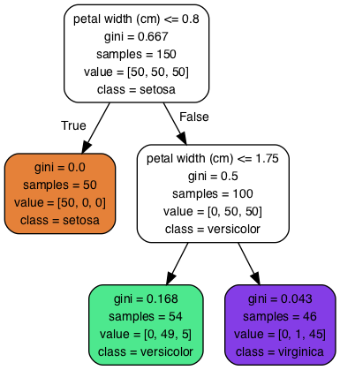

# Decision Trees

Here are some notes that I jot down from [Hands-on Machine Learning with Scikit-Learn and TensorFlow](http://shop.oreilly.com/product/0636920052289.do). 

The jupyter notebook that I ran through this part can be found here: [html](https://htmlpreview.github.io/?https://github.com/xuzhou338/DS_tools/blob/master/machine_learning/decision_trees/decision_trees.html) and [Jupyter Notebook](decision_trees.ipynb).

## Table of Content

- [Concepts](#1)
- [Implementation](#2)

<a name=1></a>

## Concepts

**Decision Trees** can be used for both classification and regression tasks, and even multioutput tasks. It is a **white box model** (easy to interpret), compared to **black box models** (eg. random forest and neural network). 

One **benefit** of using decision tree is that they require very little data preparation. In particular, they don't require feature scaling or centering at all.

Scikit-Learn uses the **Classification and Regression Tree (CART)** algorithm to train, which produces **only binary trees**. It is a **greedy** algorithm: it greedily searches for an optimum split at the top level, then repeats the process at each level. It is not guaranteed to be the optimal solution, but usually reasonably good.

#### Impurity: Gini vs Entropy

**gini**: a node's gini attribute measures its impurity. A node is "pure" (gini=0) if all training instances it applies belong to the same calss. It is calculated using the following equation:

**Entropy**: Used as an impurity measure here. A set's entropy is zero when it contains instances of only one class.

For most of the time, there's no big difference between them. Gini is slightly faster to compute, but entropy tends to produce slightly more balanced trees. The default in scikit-learn is gini.

#### Regularization

**Nonparametric model**: The number of parameter is not determined prior to training, so the model structure is free to stick close to the data, which will lead to overfitting.

To prevent overfitting, we can reduce `max_depth` to restrict the maximum depth of the decision tree. Other hyperparameters include:

`min_sample_split`: The minimum number of samples a node must have before it can be split.

`min_samples_leaf`: The minimum number of samples a leaf node must have.

`min_weight_fraction_leaf`: Same as above, but expressed as fraction.

`max_leaf_nodes`: Maxinum number of leaf nodes.

`max_features`: Max number of features that are evaluated for splitting at each node.

#### Limitation

- Decision trees love orthogonal decision boundaries, which makes them **sensitive to training set rotation**. This can be partially solved using PCA.
- They are very **sensitive to small variations** in the training data, which makes it not stable and may lead to different models using same data if not specifying random state. This instability issue can be limited by using random forest by averaging predictions over many trees.

<a name=2></a>

## Implementation

#### Classification

Make a decision tree classifier

```python
from sklearn.datasets import load_iris
from sklearn.tree import DecisionTreeClassifier

iris = load_iris()
X = iris.data[:, 2:] # petal length and width
y = iris.target

tree_clf = DecisionTreeClassifier(max_depth=2)
tree_clf.fit(X, y)
```

Visualize the tree by using `export_graphviz`:

```python
from sklearn.tree import export_graphviz

with open("iris_tree.dot", 'w') as f:
    export_graphviz(tree_clf,
                    out_file=f,
                   feature_names=iris.feature_names[2:],
                   class_names=iris.target_names,
                   rounded=True,
                   filled=True)
```

Need to run the following in the command line to convert the `.dot` file to `.png`:

```bash
dot -Tpng iris_tree.dot -o iris_tree.png
```



#### Regression

```python
from sklearn.tree import DecisionTreeRegressor

tree_reg = DecisionTreeRegressor(max_depth=2)
tree_reg.fit(X, y)
```

