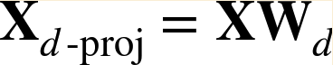

# Dimensionality Reduction

Here are some notes that I jot down from [Hands-on Machine Learning with Scikit-Learn and TensorFlow](http://shop.oreilly.com/product/0636920052289.do). 

The jupyter notebook that I ran through this part can be found here: [Jupyter Notebook](dim_reduction.ipynb).

### Table of Content

- [Curse of Dimensionality](#curse_of_dimensionality)
- [Projection (PCA)](#pca)
- [Manifold Learning (LLE)](#lle)

<a name='curse_of_dimensionality'></a>

### Curse of Dimensionality

High-dimensional datasets are at risk of being very sparse: most training instances are likely to be far away from each other. So, the more dimensions the training set has, the greater the risk of overfitting it will have.

**Note**: Even though dimensionality reduction is important, we should still firt try to train the system with original data befor considering using dimensionality reduction if training is too slow.

There are two main approches to reduce dimensionality: **projection** and **Manifold Learning**.

<a name='pca'></a>

### Projection (PCA)

**Principal Component Analysis (PCA)** is the most popular dimensionality reduction algorithm. It identifies the hyperplan that lies closest to the data and then project the data onto it. It select the axes that **preserve the maximum amount of variance**, as they will most likely lose less information than the other projections.

The PCA is usually done using **Singular Value Decomposition (SVD)** that decompose the training set matrix X into the matrix multiplication of three matrices $U\sum V^T$ where $V$ contains all the principal components that we are looking for.



Then the projected matrix can be calculated using the above equation, where $W_d$ is the matrix that contains our desired numbers of principal components, subsetted from $V$.

```python
import numpy as np

# Example of projection using SVD
X_centered = X - X.mean(axis=0)
U, s, Vt = np.linalg.svd(X_centered)
W2 = Vt.T[:, :2]
X2D_1 = X_centered.dot(W2)
```

```python
from sklearn.decomposition import PCA

# Example of using PCA
pca = PCA(n_components=2)
X2D_2 = pca.fit_transform(X)
```

#### Hyperparameter Tuning - Choosing the right number of dimensions

As a rule of thumb, it is generally preferable to choose the number of dimensions that add up to a sufficiently large portion of the variance (eg. 95%). 

```python
pca = PCA()
pca.fit(X_train)
cumsum = np.cumsum(pca.explained_variance_ratio_)
d = np.argmax(cumsum >= 0.95 + 1)
```

In order for visualization, we usually reduce the dimensionality to 2 or 3.

#### Kernel PCA

**Kernel tricks** can be used to implicitly map instances into a very high-dimensional space (feature space), enabling nonlinear classification and regression with support vector machines. The same trick can also be applied with PCA, making it possible to perform complex nonlinear projections for dimensionality reduction, call **Kernel PCA (kPCA)**.

```python
from sklearn.decomposition import KernelPCA

rbf_pca = KernelPCA(n_components=2,
                    kernel='rbf',
                    gamma=0.04)
X_reduced = rbf_pca.fit_transform(X)
```

kPCA is an unsupervised learning algorithm, so there is no obvious performance measure to help selecting the best kernel and hyperparameter values. This can usually be tackled in the following two ways:

1. Couple it with a supervised learning task using pipeline, and then use grid search to select the kernel and hyperparameters that lead to the best performance on the task.
2. Another approach, which is entirely unsupervised, is to select the kernel and hyperparameters that yield the lowest reconstruction error.

<a name='lle'></a>

### Manifold Learning (LLE)

**Locally Linear Embedding (LLE)** is another very powerful nonlinear dimensionality reduction (NLDR) technique. It works by first measuring how each training instance linearly relates to its closest neighbors and then looking for a low-dimensional representation of the training set where these local relationships are best preserved.

```python
from sklearn.manifold import LocallyLinearEmbedding

lle = LocallyLinearEmbedding(n_components=2,
                             n_neighbors=10)
X_reduced = lle.fit_transform(X)
```

**Note**: this algorithm might scale poorly to very large datasets.