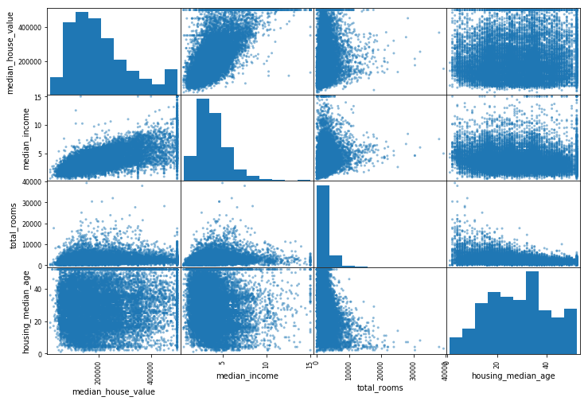

# End-to-End Project

Here are some notes that I jot down from [Hands-on Machine Learning with Scikit-Learn and TensorFlow](http://shop.oreilly.com/product/0636920052289.do). 

**A good checklist for every ML project**

[Useful end-to-end project checklist](project_checklist.md)

The jupyter notebook that I ran though in this part, slightly modified from the textbook, can be found here: [html](https://htmlpreview.github.io/?https://github.com/xuzhou338/DS_tools/blob/master/machine_learning/end-to-end_project/housing_example.html) or [jupyter notebook](housing_example.ipynb)

## Table of Content

- [Find data](#find)
- [Look at big picture](#big_picture)
- [Get the data](#get)
- [Visualize the data](#visualize)
- [Prepare data for machine learning](#prepare)
- [Select and train the model](#train)
- [Fine-tune the model](#tune)

<a name="find"></a>

## Find Data

### Popular open data repositories

[UC Irvine Machine Learning Repository](http://archive.ics.uci.edu/ml/index.php)

[Kaggle Datasets](https://www.kaggle.com/datasets)

[Amazon's AWS Dataset](https://registry.opendata.aws)

### Meta portals (list of data repositories)

http://dataportals.org

http://opendatamonitor.eu/ 

http://quandl.com/ 

<a name="big_picture"></a>

## Look at big picture

- See the objective
- How benefit from it
- Current solution
- Think about models
- Choose performance measure
  - Ways to measure the distance - $l$ norms
  - $l_k$ norm: $||v||_k=(|v_0|^k+|v_1|^k+\dots+|v_n|^k)^{\frac{1}{k}}$
  - eg, $l_0$ norm (just give the number of non-zero elements in the vector), $l_1$ norm (mean absolute error(MAE or Manhattan norm) ), $l_2$ norm (root of mean sum square(RMSE), $l_\infty$ norm (gives the max absolute value))
  - **The higher the norm index, the more it focuses on large values and neglects small ones**. This is why the RMSE is more sensitive to outliers than the MAE. But when outliers are exponentially rare (like in a bell-shaped curve), the RMSE performs very well and is generally preferred.
- Check assumptions

<a name="get"></a>

## Get the data

Can write similar things to fetch the data:

```python
# Make the function to fetech the data automatically
def fetch_housing_data(housing_url=HOUSING_URL, housing_path=HOUSING_PATH):
    if not os.path.isdir(housing_path):
        os.makedirs(housing_path)
    tgz_path = os.path.join(housing_path, "housing.tgz")
    urllib.request.urlretrieve(housing_url, tgz_path)
    housing_tgz = tarfile.open(tgz_path)
    housing_tgz.extractall(path=housing_path)
    housing_tgz.close()
```

Some useful trick using pandas to glance the data:

```python
# Look at the first couple of entries
data.head()

# Look at the info of the columns
data.info()

# More statistical info
data.describe()

# Plot histograms on the numerical attributes
data.hist(bins=50, figsize=(20, 15))
plt.show()

```

### Create test set

Before further look into the dataset, we need to create a test set, put aside, and **never** look at it.

- Can use the train_test_split function in sklearn.
- However, need to consider **stratified sampling**, if want a balanced ratio of sample from each subgroup. This can be done using the StratifiedShuffleSplit.

<a name="visualize"></a>

## Visualize the data

- Scatter plot is a good first choice to visualize the data (can use alpha, scatter point size and point number to increase the dimensions in the plot), can use similar code like:

```python
# Use the size of scatter points to represent the population 
# and use color to represent the median house value
housing.plot(kind='scatter', x='longitude', y='latitude', alpha=0.4,
            s=housing['population']/100, label='population', c='median_house_value',
            cmap=plt.get_cmap('jet'), colorbar=True, figsize=(10,7))
plt.legend()
plt.show()
```


### Looking for correlations

- We can use the corr() method to get the correlation between the attributes.
- Then use scatter_matrix function to plot the scatter matrix plot of several selected attributes



**Note**: The correlation can only show linear relationship and may sometimes completly ignore some nonlinear features.

### Experiment with attributes combinations

We can define new features out of the existing ones and check the correlation coefficients again and see if there are some interesting patterns.

<a name="prepare"></a>

## Prepare data for machine learning

For this part it is preferable to automate the work and write function for several reasons:

- Allow us to reproduce transformations easily on any dataset.
- We can gradually build a library of transformation functions that we can reuse in future projects.
- We can use these functions in live systems to transform new data before feeding to the algorithms.
- This makes it possible to try various of transformations and make hyperparameters for fine tuning.

### Data cleaning

For missing data, we have three options:

1. Get rid of the corresponding entries.
2. Get rid of the whole attribute
3. Set them with some values (zero, mean, median, etc.). Example shown below:

```python
from sklearn.impute import SimpleImputer
imputer = SimpleImputer(strategy='median')
imputer.fit(housing_num)
```

### Handle text and categorical attributes

There are several options, such as:

- OrdinalEncoder: Encode categories with numbers. Might be useful for ordered categories.
- OneHotEncoder: Encode with only 1 and 0. Better for distinct categories.

### Custom transformers

Sometimes we need to write our own tranformation function beside the existing ones in scikit-learn library, an example is shown below:

```python
# Custom Transformation
from sklearn.base import BaseEstimator, TransformerMixin

room_ix, bedroom_ix, population_ix, households_ix = 3, 4, 5, 6

class CombinedAttributesAdder(BaseEstimator, TransformerMixin):
    def __init__(self, add_bedrooms_per_room=True):
        self.add_bedrooms_per_room = add_bedrooms_per_room
    def fit(self, X, y=None):
        return self
    def transform(self, X, y=None):
        rooms_per_household = X[:, room_ix] / X[:, households_ix]
        population_per_household = X[:, population_ix] / X[:, households_ix]
        if self.add_bedrooms_per_room:
            bedrooms_per_room = X[:, bedroom_ix] / X[:, room_ix]
            return np.c_[X, rooms_per_household, population_per_household, bedrooms_per_room]
        else:
            return np.c_[X, rooms_per_household, population_per_household]
        
attr_adder = CombinedAttributesAdder(add_bedrooms_per_room=False)
housing_extra_attribs = attr_adder.transform(housing.values)
```

The True/False setting is helpful for setting the hyperparameter in the later fine-tuning process.

### Feature scaling

There are two common ways to get all attributes to have the same scale:

1. min-max scaling: bound values between 0 and 1
2. standardization: like z-score.

### Transformation pipelines

Can use pipeline to make several transformations on the same dataset in a certain order:

```python
from sklearn.pipeline import Pipeline
from sklearn.preprocessing import StandardScaler

num_pipeline = Pipeline([
    ('imputer', SimpleImputer(strategy='median')),
    ('attr_adder', CombinedAttributesAdder()),
    ('std_scaler', StandardScaler())
])

housing_num_tr = num_pipeline.fit_transform(housing_num)
```

Can even mismatch different types of attributes (numerical and categorical) in a pipeline:

```python
from sklearn.compose import ColumnTransformer

num_attribs = list(housing_num)
cat_attribs = ['ocean_proximity']

full_pipeline = ColumnTransformer([
    ('num', num_pipeline, num_attribs),
    ('cat', OneHotEncoder(), cat_attribs)
])

housing_prepared = full_pipeline.fit_transform(housing)
```

<a name="train"></a>

## Select and train model

```python
# Fit the model
from sklearn.linear_model import LinearRegression

lin_reg = LinearRegression()
lin_reg.fit(housing_prepared, housing_labels)

# See the loss
from sklearn.metrics import mean_squared_error

housing_predictions = lin_reg.predict(housing_prepared)
lin_mse = mean_squared_error(housing_labels, housing_predictions)
linrmse = np.sqrt(lin_mse)
linrmse
```

We can have a better evaluation using cross-validation:

```python
from sklearn.model_selection import cross_val_score

lin_scores = cross_val_score(lin_reg, housing_prepared, housing_labels,
                            scoring='neg_mean_squared_error', cv=10)
lin_rmse_scores = np.sqrt(-lin_scores)
```

Models can be save and loaded:

```python
from sklearn.externals import joblib

joblib.dump(my_model, "my_model.pkl") # Save
my_model_loaded = joblib.load("my_model.pkl") # Load
```

<a name="tune"></a>

## Fine-tune the model

We can use grid search when the hyperparameter space is too large.

```python
from sklearn.model_selection import GridSearchCV

param_grid = [
    {'n_estimators': [3, 10, 30], 'max_features': [2, 4, 6, 8]},
    {'bootstrap': [False], 'n_estimators': [3, 10], 'max_features': [2, 3, 4]}
]

forest_reg = RandomForestRegressor()
grid_search = GridSearchCV(forest_reg, param_grid, cv=5,
                          scoring='neg_mean_squared_error', return_train_score=True)
grid_search.fit(housing_prepared, housing_labels)
```

Other approaches including randomized search (explore hyperparameter combinations more randomly) and ensemble methods (combine individual models and improve performance). 

After having the combination that yields the minimum loss, we case see the importance of each attributes and consider deleting or changing some of those:

```python
grid_search.best_estimator_.feature_importances_
```

Iterate the process and find the best model before finally evaluate the model using the test set.