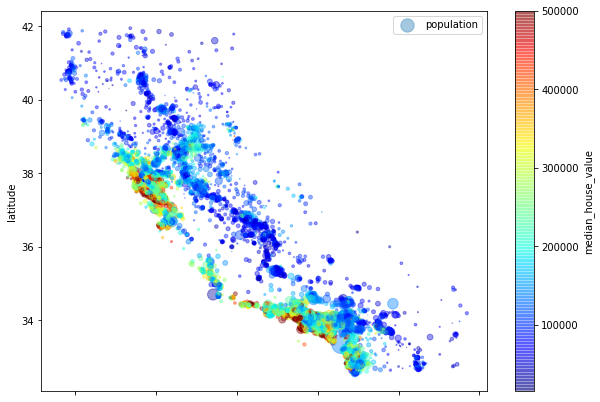

# End-to-End Project

Here are some notes that I jot down from [Hands-on Machine Learning with Scikit-Learn and TensorFlow](http://shop.oreilly.com/product/0636920052289.do). 

**A good checklist for every ML project**

[Useful end-to-end project checklist](project_checklist.md)

The jupyter notebook that I ran though in this part, slightly modified from the textbook, can be found here: [html](housing_example.html) or [jupyter notebook](housing_example.ipynb)

## Table of Content

## Find Data

### Popular open data repositories

[UC Irvine Machine Learning Repository](http://archive.ics.uci.edu/ml/index.php)

[Kaggle Datasets](https://www.kaggle.com/datasets)

[Amazon's AWS Dataset](https://registry.opendata.aws)

### Meta portals (list of data repositories)

http://dataportals.org

http://opendatamonitor.eu/ 

http://quandl.com/ 

## Look at big picture

- See the objective
- How benefit from it
- Current solution
- Think about models
- Choose performance measure
  - Ways to measure the distance - $l$ norms
  - $l_k$ norm: $||v||_k=(|v_0|^k+|v_1|^k+\dots+|v_n|^k)^{\frac{1}{k}}$
  - eg, $l_0$ norm (just give the number of non-zero elements in the vector), $l_1$ norm (mean absolute error(MAE or Manhattan norm) ), $l_2$ norm (root of mean sum square(RMSE), $l_\infty$ norm (gives the max absolute value))
  - **The higher the norm index, the more it focuses on large values and neglects small ones**. This is why the RMSE is more sensitive to outliers than the MAE. But when outliers are exponentially rare (like in a bell-shaped curve), the RMSE performs very well and is generally preferred.

- Check assumptions

## Get the data

Can write similar things to fetch the data:

```python
# Make the function to fetech the data automatically
def fetch_housing_data(housing_url=HOUSING_URL, housing_path=HOUSING_PATH):
    if not os.path.isdir(housing_path):
        os.makedirs(housing_path)
    tgz_path = os.path.join(housing_path, "housing.tgz")
    urllib.request.urlretrieve(housing_url, tgz_path)
    housing_tgz = tarfile.open(tgz_path)
    housing_tgz.extractall(path=housing_path)
    housing_tgz.close()
```

Some useful trick using pandas to glance the data:

```python
# Look at the first couple of entries
data.head()

# Look at the info of the columns
data.info()

# More statistical info
data.describe()

# Plot histograms on the numerical attributes
data.hist(bins=50, figsize=(20, 15))
plt.show()

```

### Create test set

Before further look into the dataset, we need to create a test set, put aside, and **never** look at it.

- Can use the train_test_split function in sklearn.
- However, need to consider **stratified sampling**, if want a balanced ratio of sample from each subgroup. This can be done using the StratifiedShuffleSplit.

## Visualize the data

- Scatter plot is a good first choice to visualize the data (can use alpha, scatter point size and point number to increase the dimensions in the plot), can use similar code like:

```python
# Use the size of scatter points to represent the population 
# and use color to represent the median house value
housing.plot(kind='scatter', x='longitude', y='latitude', alpha=0.4,
            s=housing['population']/100, label='population', c='median_house_value',
            cmap=plt.get_cmap('jet'), colorbar=True, figsize=(10,7))
plt.legend()
plt.show()
```




