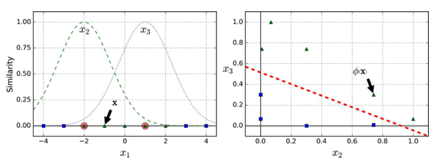
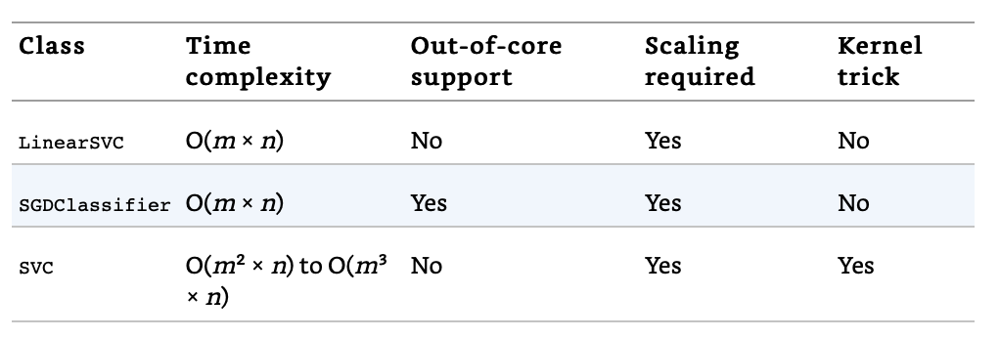

# Support Vector Machines

Here are some notes that I jot down from [Hands-on Machine Learning with Scikit-Learn and TensorFlow](http://shop.oreilly.com/product/0636920052289.do). 

The jupyter notebook that I ran through this part can be found here: [html](https://htmlpreview.github.io/?https://github.com/xuzhou338/DS_tools/blob/master/machine_learning/svm/svm.html) and [Jupyter Notebook](svm.ipynb).

## Table of Content

- [Linear SVM Classification](#1)

- [Nonlinear SVM Classification](#2)
- [SVM Regression](#3)

<a name='1'></a>

## Linear SVM Classification

Uses support vectors (instances at the end of the "street") to draw the boundary between classes. 

**Note**: It can usually achieve better performance by using standard scaler.


**Hard Margin Classification**: Strictly imporse that all instances be off-street and on the right side.

**Soft Margin Classification**: Allows some violations to keep the street as large as possible.

**Hyperparameter C**: Smaller value leads to wider street but more margin violations. Usually need to reduce when overfitting.


#### Example using LinearSVC

```python
import numpy as np
from sklearn import datasets
from sklearn.pipeline import Pipeline
from sklearn.preprocessing import StandardScaler
from sklearn.svm import LinearSVC

iris = datasets.load_iris()
X = iris['data'][:, (2, 3)] # petal length, petal width
y = (iris['target'] == 2).astype(np.float64) # iris-virginica

svm_clf = Pipeline([
    ('scaler', StandardScaler()),
    ('linear_svc', LinearSVC(C=1, loss='hinge')),
])
svm_clf.fit(X,y)
```

<a name='2'></a>

## Nonlinear SVM Classification

#### Polynomial Kernel

```python
from sklearn.svm import SVC

poly_kernel_svm_clf = Pipeline([
    ('scaler', StandardScaler()),
    ('svm_clf', SVC(kernel='poly', degree=3, coef0=1, C=5))
])
poly_kernel_svm_clf.fit(X, y)
```

The hyperparameter coef0 controls how much the model is influence by high-degree polynomials versus low-degree polynomials.

#### Gaussian RBF Kernel

**Gaussian Radial Basis Function (RBF)** is a similarity function that by comoputing how much each instance resembles a paticular landmark.



```python
rbf_kernel_svm_clf = Pipeline([
    ('scaler', StandardScaler()),
    ('svm_clf', SVC(kernel='rbf', gamma=5, C=0.001))
])
rbf_kernel_svm_clf.fit(X, y)
```

The hyperparameter gamma controls the bell shape where larger value makes it narrower and the decision boundary more irregular. A smaller value makes it wider and the decision boundary smoother. So if overfitting, need to reduce gamma.

#### Choose Kernel

- Always try the linear kernel first using `LinearSVC` instead of `SVC(kernel="linear")`, especially if the training set is very large of if it has plenty of features.
- Then if the training set is not too large, we can try RBF kernel.
- Then experiment with others.

**Time complexity**



<a name='3'></a>

## SVM Regression

The trick is to reverse the objective: instead of trying to fit the largest possible street between two classes while limiting margin violations, SVM Regression tries to fit as many instances as possible on the street while limiting margin violations (i.e., instances off the street). 

#### Linear SVM Regressor

```python
from sklearn.svm import LinearSVR

svm_reg = LinearSVR(epsilon=1.5)
svm_reg.fit(X, y)
```

#### NonLinear SVM Regressor

```python
from sklearn.svm import SVR

svm_poly_reg = SVR(kernel='poly', degree=2, C=100, epsilon=0.1, gamma='auto')
svm_poly_reg.fit(X, y)
```

The hyperparameter epsilon here controls the margin size. Larger epsilon, larger margin.