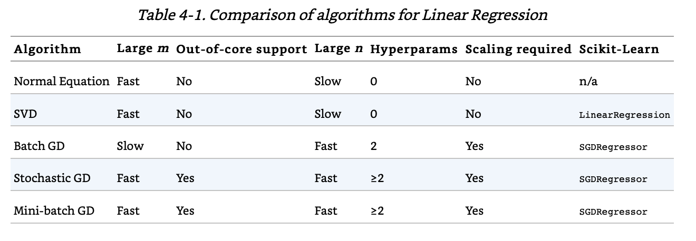
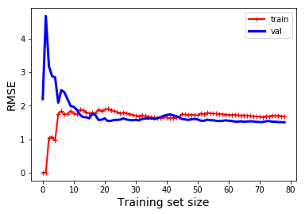
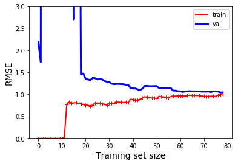

# Training Models

Here are some notes that I jot down from [Hands-on Machine Learning with Scikit-Learn and TensorFlow](http://shop.oreilly.com/product/0636920052289.do). 

The jupyter notebook that I ran through this part can be found here: [html](https://htmlpreview.github.io/?https://github.com/xuzhou338/DS_tools/blob/master/machine_learning/training_models/training_models.html) and [Jupyter Notebook](training_models.ipynb).

## Table of Content

- [Linear Regression](#1)
- [Gradient Descent](#2)
- [Polynomial Regression](#3)
- [Learning Curves](#4)
  - [Underfitting](#4-1)
  - [Overfitting](#4-2)
- [Regularized Linear Models](#5)
  - [Ridge Regression](#5-1)
  - [Lasso Regression](5-2)
  - [Elastic Net](#5-3)
- [Logistic Regression](#6)

<a name='1'></a>

## Linear Regression

- Normal Equation
- Singular Value Decomposition (SVD)

```python
from sklearn.linear_model import LinearRegression

lin_reg = LinearRegression()
lin_reg.fit(X, y)
```

<a name='2'></a>

## Gradient Descent

**Gradient Descent** is a very generic optimization algorithm capable of finding optimal solutions to a wide range of problems. We need to **random initialize** the coefficient and take baby steps to find the minimum of the convex cost function.

**Note**: We need to ensure all features have a similar scale, or it will take much longer to converge. For example, we can use the `StandardScaler` class in Scikit-Learn.

### Types

#### Batch Gradient Descent

It uses the full training set X at each gradient descent step.

#### Stochastic Gradient Descent (SGD)

It just picks a random instance in the training set at every step and compute the gradients based only on that single instance. It has a better chance than the batch gradient descent to find the global minimum. On drawback is that this algorithm can never settle at the minimum, so one solution is to gradually reduce the learning rate using a function called **learning schedule**, which is similar to **simulated annealing**.

```python
from sklearn.linear_model import SGDRegressor

sgd_reg = SGDRegressor(max_iter=50, penalty=None, eta0=0.1, tol=1e-3)
sgd_reg.fit(X, y.ravel())
```

#### Mini-batch Gradient Descent

It is between Batch GD and Stochastic GD. It uses small random sets of instanced called mini-batches. The main advantage of Mini-batch GD over Stochastic GD is that you can get a performance boost from hardware optimization of matrix operations, especially when using GPUs. 



<a name='3'></a>

## Polynomial Regression

We can add powers to each features as new features and then train a linear model on the extended set of features.

```python
from sklearn.preprocessing import PolynomialFeatures

# Add the square as a second feature
poly_features = PolynomialFeatures(degree=2, include_bias=False)
X_poly = poly_features.fit_transform(X)
lin_reg = LinearRegression()
lin_reg.fit(X_poly, y)
```

When there are multiple features, the polynomial regression is capable of finding relationships between features by adding combinations of features.

<a name='4'></a>

## Learning Curves

**Bias**: High when we have wrong assumptions on the model, usually underestimate the complexity of the model.

**Variance**: High when it has excessive sensitivity to small variations in the training data.

<a name='4-1'></a>

#### Underfitting

High **bias** and low **variance**. Perform poorly on both training and validation sets. Need to use a more complex model or come up with better features.



<a name='4-2'></a>

#### Overfitting

Low **bias** and high **variance**. Perform well on training set, but generalizes poorly on validation set.



<a name='5'></a>

## Regularized Linear Models

A regularization term is added to the cost function. The alpha is a hyperparameter that at alpha=0, it is just linear regression. If alpha is very large, then all weights end up very close to zero and the result is a flat line going through the data's mean. Alpha represent how much the linear model is regularized.

<a name='5-1'></a>

### Ridge Regression

Ridge has a l2 norm of the weight vector, so it has a l2 penalty. There are two ways to implement:

```python
from sklearn.linear_model import Ridge

ridge_reg = Ridge(alpha=1, solver='cholesky')
ridge_reg.fit(X, y)
ridge_reg.predict([[1.5]])
```

```python
sgd_reg = SGDRegressor(penalty='l2', max_iter=1000, tol=1e-3)
sgd_reg.fit(X, y.ravel())
sgd_reg.predict([[1.5]])
```

<a name='5-2'></a>

### Lasso Regression

Lasso uses l1 norm instead of l2. Different from RIdge, it tends to completely eliminate the weights of the least important features and set them to 0. It also has two ways to implement:

```python
from sklearn.linear_model import Lasso

lasso_reg = Lasso(alpha=0.1)
lasso_reg.fit(X, y)
lasso_reg.predict([[1.5]])
```

```python
sgd_reg = SGDRegressor(penalty='l1', max_iter=1000, tol=1e-3)
sgd_reg.fit(X, y.ravel())
sgd_reg.predict([[1.5]])
```

<a name='5-3'></a>

### Elastic Net

It is in the middle between RIdge regression and Lasso regression. It uses a hypterparameter r that when r=0, it is Ridge regression; when r=1, it is Lasso regression.

```python
from sklearn.linear_model import ElasticNet

elastic_net = ElasticNet(alpha=0.1, l1_ratio=0.5)
elastic_net.fit(X, y)
elastic_net.predict([[1.5]])
```

When should you use plain Linear Regression (i.e., without any regularization), Ridge, Lasso, or Elastic Net? It is almost always preferable to have at least a little bit of regularization, so generally you should avoid plain Linear Regression. Ridge is a good default, but if you suspect that only a few features are actually useful, you should prefer Lasso or Elastic Net since they tend to reduce the useless features’ weights down to zero as we have discussed. In general, Elastic Net is preferred over Lasso since Lasso may behave erratically when the number of features is greater than the number of training instances or when several features are strongly correlated. 

<a name='6'></a>

## Logistic Regression

Logistic Regression (also called Logit Regression ) is commonly used to estimate the probability that an instance belongs to a particular class (e.g., what is the probability that this email is spam?). 

**Note**: It uses l2 penalty by default, and it has hyperparameter C instead of alpha. C is the inverse of alpha. The **higher** the C is, the **less** the model is regularized.

```python
from sklearn.linear_model import LogisticRegression

log_reg = LogisticRegression(solver='lbfgs')
log_reg.fit(X, y)
```

### Softmax Regression

The Logistic Regression model can be generalized to support multiple classes directly, without having to train and combine multiple binary classifiers. This is called Softmax Regression, or Multinomial Logistic Regression. It uses cross entropy as cost function so that minimize it gives better results.

**Note**: It is multiclass classification, not multiouput.

```python
softmax_reg = LogisticRegression(multi_class='multinomial', solver='lbfgs', C=10)
softmax_reg.fit(X, y)
```

