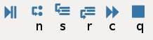

# Debug with Spyder (pdb)

**To hard code pdb**:

Put `import pdb; pdb.set_trace()` as breakpoint at where we want to debug and run the code. It will open the pdb console.

**In Spyder**:

Optional: Place breakpoints on those lines we want to debug.

Then click <u>debug</u> (⌘F5) or <u>debug cell</u> (⌥⇧↩) to enter the debug mode (ipdb console).

## Debug Tricks

### Useful pdb commands

`h`: displays the commands

`a`: prints arguments that passed inside the function

`!`: escape character that avoids conflicts between these commands and variables

`unt`: until - continue execution until the line with a number greater than the current one is reached, useful to get out of a loop

`j`: jump - jump to a specific line, eg. jump 68

`d`: down - move down a frame

`u`: up - move up a frame

`n`: next - continue execution until the next line

`s`: step into - similar to next, but the difference here is "step into" will go into any functions that used in this line, but "next" does not

`r`: step return - continue excution until the current function returns

`c`: continue - only stops when a breakpoint is encountered

`q`: exit the debug console

Here is a shortcut map for corresponding pdb commands (5 ones above) showing as Spyder icons.

### Use variable explorer in Spyder

There are some commands that can be replaced by using the variable explorer instead of typing:

`p`: print the value

`pp`: pretty print the value

`whatis`: print the type of the expression 

### Use conditional breakpoints

After setting the breakpoints, we can open the breakpoints pane and add conditions to them (eg. `type(result)==str`). In this case, we can set many breakpoints, and only if the conditions are meet (True), it will stop.

# References

Python stardard library documentation (pdb): https://docs.python.org/3.8/library/pdb.html

Stacks Overflow: https://stackoverflow.com/a/47599671/12985675

